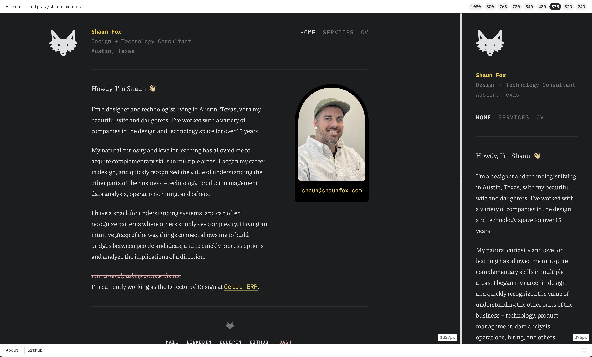

# Flexo

A rebuild of the old Flexiblewidth app on React 19, Vite+, Panda CSS, and `@okshaun/components`.

<!---->


  
## What it does

- Launches a live URL or localhost target in two iframe previews.
- Compares a fluid preview against a fixed-width viewport.
- Supports preset widths plus drag resizing in split mode.
- Persists the active URL and selected width in the query string.
- Uses Panda-generated styles with okshaun primitives instead of hand-written component CSS.

## Run locally

```bash
vp install
vp dev
```

Then open the local Vite URL shown in the terminal.

## Verify

```bash
vp check
vp test
vp build
```

## Screenshot companion

Flexo can capture full-page screenshots for both preview widths by talking to a local Playwright
companion running on `127.0.0.1:43127`.

Install the browser binary once:

```bash
npx playwright install chromium
```

Start the companion in another terminal:

```bash
npm run companion
```

Allowed origins default to:

- `http://localhost:5173`
- `http://127.0.0.1:5173`

To allow a hosted Flexo deployment, set one or both of these before starting the companion:

```bash
FLEXO_PRODUCTION_ORIGIN='https://your-flexo.example.com' npm run companion
```

```bash
FLEXO_ALLOWED_ORIGINS='https://your-flexo.example.com,https://another-origin.example.com' npm run companion
```

The companion only supports anonymous pages in v1. It does not reuse your existing browser login
session or persist cookies between captures.

## GitHub Pages prep

The repo now includes [`.github/workflows/pages.yml`](./.github/workflows/pages.yml), which builds and deploys to GitHub Pages on pushes to `main`.

Locally, the Pages build uses the repo base path:

```bash
npm run build:pages
```

To finish setup in GitHub:

1. Open the repository on GitHub.
2. Go to `Settings` > `Pages`.
3. Under `Build and deployment`, set `Source` to `GitHub Actions`.

The workflow also respects `GITHUB_PAGES_BASE` if you need to override the detected base path.
